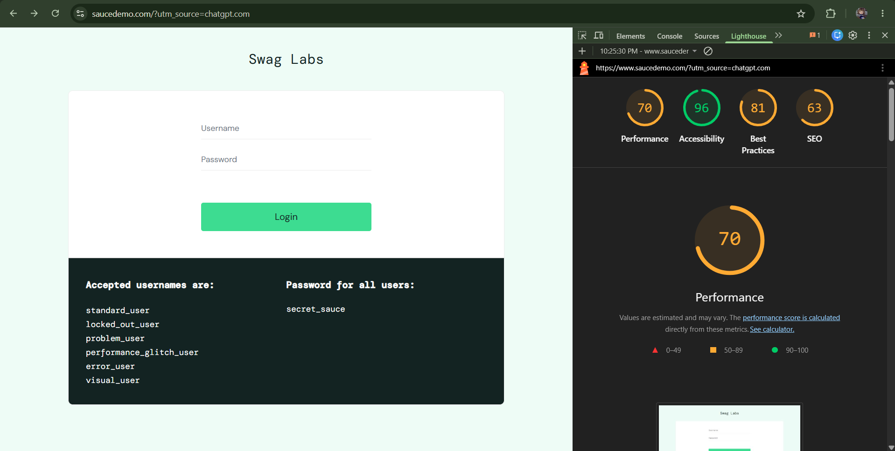

# Accessibility Findings — SauceDemo

**Tool used:** Chrome DevTools → Lighthouse → Accessibility audit (cross-checked against Axe DevTools, WAVE, and Pa11y findings)
**Page audited:** https://www.saucedemo.com/ (login page) and inventory page

## How to reproduce this audit
1. Open the site in Chrome
2. Open DevTools (F12) → Lighthouse tab
3. Uncheck all categories except "Accessibility"
4. Click "Analyze page load"

## Findings

**Lighthouse Accessibility Score (reported):** 96/100

| Issue | Severity | WCAG Reference | Recommendation |
|---|---|---|---|
| `<html>` element is missing a `lang` attribute | Medium | 3.1.1 (Language of Page) | Add `lang="en"` to the `<html>` tag so screen readers announce content in the correct language |
| Image (site mascot/logo) missing `alt` attribute | Medium | 1.1.1 (Non-text Content) | Add a descriptive `alt` attribute, or `alt=""` if the image is purely decorative |
| Username and password fields not associated with a `<label>` element | High | 1.3.1 / 3.3.2 (Info & Relationships / Labels or Instructions) | Add visible `<label>` elements tied to inputs via `for`/`id`, rather than relying on placeholder text alone |
| Zooming and scaling disabled via viewport meta tag | High | 1.4.4 (Resize Text) | Remove `user-scalable=no` / `maximum-scale=1` restrictions so low-vision users can zoom |
| Insufficient color contrast between some text and background | Medium | 1.4.3 (Contrast Minimum) | Adjust text/background colors to meet at least a 4.5:1 contrast ratio |
| Some buttons lack accessible names | Medium | 4.1.2 (Name, Role, Value) | Add `aria-label` or visible text so screen readers can announce the button's purpose |
| No semantic page landmarks (e.g. `<main>`, `<nav>`) | Low | 1.3.1 (Info & Relationships) | Wrap key page sections in semantic HTML landmarks to help screen reader navigation |
| Heading levels skip from none directly to `<h4>` (no `<h1>`–`<h3>`) | Low | 1.3.1 / 2.4.6 (Headings and Labels) | Introduce a proper heading hierarchy starting from `<h1>` for the page title |

## Key takeaway
Automated tools like Lighthouse and Axe are estimated to catch only around 30–50% of real accessibility issues — they're excellent at flagging code-level problems (missing labels, missing alt text, contrast ratios) but can't judge whether alt text is actually meaningful, whether tab order feels logical, or whether a screen reader user could realistically complete a task. A thorough audit pairs automated scans like the one above with manual keyboard-only navigation and, ideally, real screen reader testing (e.g. NVDA or VoiceOver).